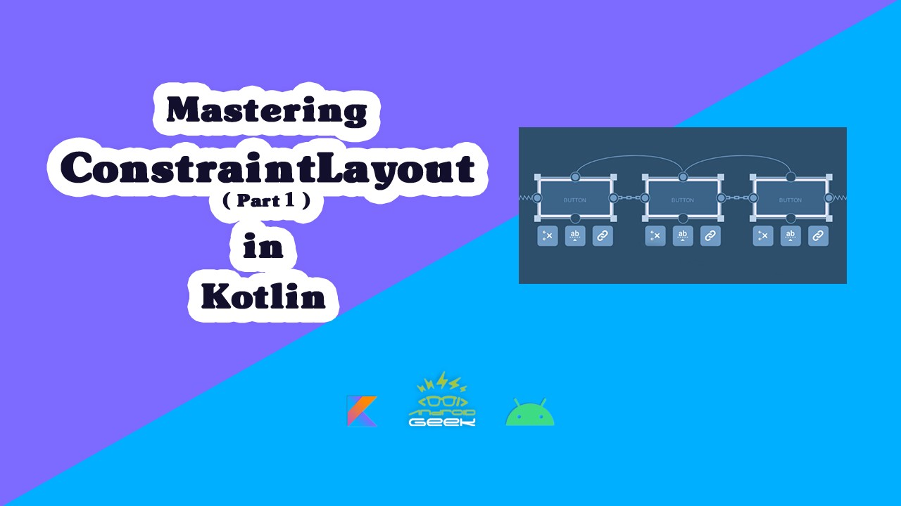
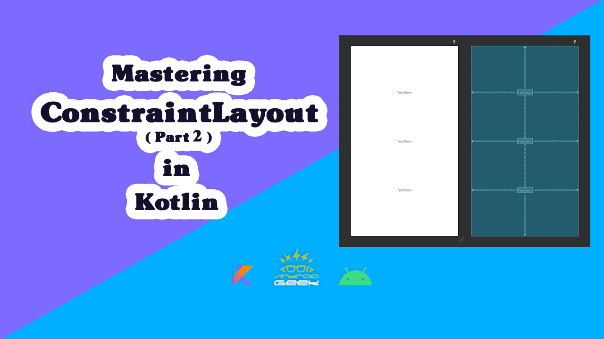

# ConstraintLayout-Youtube

</a>

YouTube Video :

Part 1
   

 
 
Part 2
   

edium's Article :
 
Part 1 : 
https://medium.com/@ezatpanah/mastering-constraintlayout-part-1-6a8cf0dfd3d6
 
Part 2 : 
https://medium.com/@ezatpanah/mastering-constraintlayout-part-2-443cd7bd6392

✨ Join Medium to read thousands of valuable stories ✨
 
https://medium.com/@ezatpanah/membership
